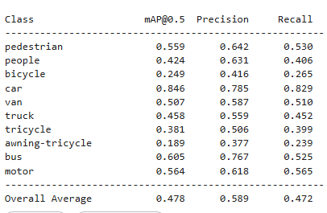

# VisDrone_YOLO_humancar
## VisDrone Human & Car Detection System
Antlings Internship Assessment — AI/ML Drone Human Detection & Counting

## Overview
A computer vision pipeline for detecting humans and cars in drone/aerial imagery using YOLOv8, trained on the VisDrone 2019 dataset. The system detects pedestrians, people, and cars — counting total humans and visualizing results with bounding boxes.

## Tasks Completed
- Task 01: Dataset Understanding & Preprocessing
- Task 02: Model Training (YOLOv8s)
- Task 03: Human & Car Detection with Counting
- Task 04: Object Tracking (ByteTrack) (Bonus Task)
- Task 05: Evaluation & Visualization

## Workflow & Engineering Decisions

### (Task 01) Dataset Understanding & Preprocessing
VisDrone 2019 is a large-scale aerial detection dataset with 6,471 training images, 548 validation images, and 10 object categories. The dataset comes fully pre-labeled, so no manual annotation was needed. Each image has a corresponding label file containing bounding box coordinates and class IDs.

The dataset presented several real challenges. 
- Objects are extremely small because the drone is at high altitude, and people are sometimes just a few pixels wide. 
- Dense crowds and parking lots make the detection hard. 
- There's also a significant class imbalance: cars appear 14,064 times in the validation set while buses appear only 251 times. 
- An interesting observation was that humans are split into two separate classes: "pedestrian" (walking) and "people" (standing, sitting, in groups), which complicated counting humans for the task.

For preprocessing, I relied entirely on YOLOv8's built-in augmentation pipeline: mosaic (stitches 4 images together), horizontal flipping, random scaling, and HSV jitter for lighting variation. This handled everything automatically during training.

### Sample Dataset Images
[Sample 1](sample_images/0000006_00159_d_0000001.jpg)
[Sample 2](sample_images/0000006_00611_d_0000002.jpg)
[Sample 3](sample_images/0000006_01111_d_0000003.jpg)
[Sample 4](sample_images/0000006_01275_d_0000004.jpg)
[Sample 5](sample_images/0000006_01659_d_0000004.jpg)

### (Task 02) Model Training
I chose YOLOv8s as the base model as it gives a good balance between speed and accuracy for real-time drone applications, and comes pretrained on COCO which gave a strong starting point.

The first training run used the default imgsz=640, but it was stopped early after realizing that aggressively downsampling high-resolution aerial footage causes the model to miss tiny objects. Restarted with imgsz=960, which gave the model much more detail to work with. Also, instead of filtering the labels beforehand, the model got trained on all 10 classes. This preserved dataset integrity and eliminated any risk of corrupting the annotation files. 
- Final config: imgsz=960, batch=8, epochs=50, patience=10 for early stopping.

### (Task 03) Human & Car Detection with Counting
Rather than retraining a separate model for just humans and cars, we used YOLO's native classes argument at inference time: passing classes=[0, 1, 3] to filter detections to pedestrian, people, and car only. This is cleaner, faster, and carries no risk of data manipulation.

Since VisDrone splits humans into two classes, the total human count combines both: pedestrian detections + people detections. Bounding boxes and the human count overlay are drawn directly onto the output images using OpenCV.

Sample results across 5 test images:
Image 1: Humans=4
Image 2: Humans=8
Image 3: Humans=3
Image 4: Humans=1
Image 5: Humans=0

### (Task 04) Object Tracking
ByteTrack was implemented using Ultralytics' built-in tracker. I first tested it on VisDrone image sequences, but the result looked like a slideshow because the test-dev folder mixes images from completely different drone flights. I attempted to filter by similar looking images, but still the model couldn't really keep up with tracking the same object as in each frame the camera angle chanegs significantly.

For a more convincing demo, I switched to a real continuous drone video where ByteTrack could actually maintain tracking IDs across frames naturally. I also compared ByteTrack against BoT-SORT, and noticed that both performed similarly. So, ByteTrack was kept as it is the more widely adopted standard. OC-SORT was considered for its stronger handling of fast-moving objects but skipped due to time constraints.

### (Task 05) Evaluation & Visualization

| Class | mAP@0.5 | Precision | Recall |
|---|---|---|---|
| Pedestrian | 55.9% | 64.2% | 53.0% |
| People | 42.4% | 63.1% | 40.6% |
| Bicycle | 24.9% | 41.6% | 26.5% |
| Car | 84.6% | 78.5% | 82.9% |
| Van | 50.7% | 58.7% | 51.0% |
| Truck | 45.8% | 55.9% | 45.2% |
| Tricycle | 38.1% | 50.6% | 39.9% |
| Awning-tricycle | 18.9% | 37.7% | 23.9% |
| Bus | 60.5% | 76.7% | 52.5% |
| Motor | 56.4% | 61.8% | 56.5% |
| **Overall** | **47.8%** | **58.9%** | **47.2%** |

Car detection showed very good metric with 84.3% mAP, which makes sense as cars are the most represented class here. Human detection (pedestrian+people combined) has around 50% mAP, which is reasonable for such a challenging aerial dataset. Inference runs at approximately 169 FPS, making it well-suited for real-time applications. All metrics were extracted directly from the model output rather than hardcoded. Confusion matrix, PR curve, F1 curve saved from training run and attached to the outputs_pics folder.

### Sample Outputs

### Detection Results


### Metrics Chart


### Tracking Outputs
- [ByteTrack on VisDrone sequences](outputs_tracking_video/pics_tracking_output.avi)
- [ByteTrack on real drone video](outputs_tracking_video/real_drone_tracked.avi)
- [ByteTrack on another real drone video](outputs_tracking_video/real_drone_tracked2.avi)
- [BoT-SORT on real drone video (comparison)](outputs_tracking_video/real_drone_tracked2b.avi)

### Strengths
- Excellent car detection (84.3% mAP)
- Fast inference suitable for real-time use (~169 FPS)
- Clean inference filtering without touching training data
- ByteTrack integration with minimal code

### Limitations
- Struggles with heavily occluded tiny humans
- Tracking IDs inconsistent on image sequences (not real video)
- Higher resolution (1280px) could improve small object detection further
- People vs pedestrian ambiguity affects human counting accuracy

### Challenges Faced

1. Kaggle phone verification was required to connect to internet, but verification didn't work, forcing a switch to Google Colab mid-setup. But the session lost all trained weights mid-run, had to retrain from scratch. Learned to always download the weights from output immediately after training.
2. First training run used imgsz=640 which missed tiny aerial objects. Stopped and restarted with imgsz=960.
3. VisDrone test-dev mixes frames from completely different drone flights, making ByteTrack reset every frame. Had to find and upload a real drone video separately to demonstrate proper continuous tracking.
ByteTrack assigns and loses IDs frequently on image sequences since there's no real motion between frames. Improved significantly on real continuous video.
4. First tracking video used mp4v codec which threw silent write errors. Switched to XVID with .avi format to fix it.
5. Hardcoded canvas dimensions (1280x720) squished videos that had different original aspect ratios. Fixed by reading original dimensions from the video file directly.
6. Some files were larger than 25MB so couldn't be uploaded via drag and drop in the browser. Had to use the command line with Git LFS to push it to the repository.

## Tech Stack
- Detection: YOLOv8s
- Tracking: ByteTrack
- Visualization: OpenCV
- Training: PyTorch + Kaggle T4 x2 GPU

## Project Structure
```
VisDrone_YOLO_humancar/
├── notebooks/                    # Kaggle training notebook
├── outputs_pics/                 # Detection result images with bounding boxes
├── outputs_tracking_video/       # Tracking output videos
│   ├── pics_tracking_output.avi  # ByteTrack on VisDrone image sequences
│   ├── real_drone_tracked.avi    # ByteTrack on real drone video 1
│   ├── real_drone_tracked2.avi   # ByteTrack on real drone video 2
│   └── real_drone_tracked2b.avi  # BoT-SORT on real drone video (comparison)
├── sample_images/                # Raw dataset sample images for visualization
├── weights/                      # Trained model weights
│   └── best.pt
├── README.md
├── requirements.txt
└── visdrone.yaml
```
## How to Run

### Install dependencies
```bash
pip install ultralytics opencv-python
```

### Detection & Counting
```python
from ultralytics import YOLO
import cv2

model = YOLO('weights/best.pt')

results = model.predict(
    source='your_image.jpg',
    classes=[0, 1, 3],  # pedestrian, people, car
    conf=0.25
)

for r in results:
    class_ids = r.boxes.cls.tolist()
    human_count = sum(1 for c in class_ids if c in [0, 1])
    print(f"Total Humans: {human_count}")
    r.save(filename='output.jpg')
```

### Tracking
```python
model.track(
    source='drone_video.mp4',
    classes=[0, 1, 3],
    tracker="bytetrack.yaml",
    persist=True
)
```

### Training
```python
from ultralytics import YOLO

model = YOLO('yolov8s.pt')
model.train(
    data='visdrone.yaml',
    epochs=50,
    imgsz=960,
    batch=8,
    patience=10,
    device=0
)
```

## Dataset
- Source: [VisDrone 2019 Detection Dataset](https://www.kaggle.com/datasets/banuprasadb/visdrone-dataset)
- Train: 6,471 images
- Val: 548 images
- Classes: 10 (pedestrian, people, bicycle, car, van, truck, tricycle, awning-tricycle, bus, motor)
- Target classes at inference: pedestrian (0), people (1), car (3)
- Higher resolution (1280px) could improve small object detection further
python detect.py
```
